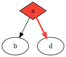

Purescript-Graphviz
===================

renders Graphs defined in `Data.DotLang` to SVG, JSON and XDOT.

```purescript
let g = DiGraph [
    node "a" [ Shape Diamond, Style Filled,  FillColor red ],
    node "b" [],
    "a" ==> "b",
    "a" ==> "d",
    Subgraph [
        node "d" []
    ]
]
let rendered = renderToSvg Dot g
```
`rendered` will be:



Development
-----------

### Running Tests

```bash
$ bower install
$ npm install # for running tests in node
$ pulp test
```